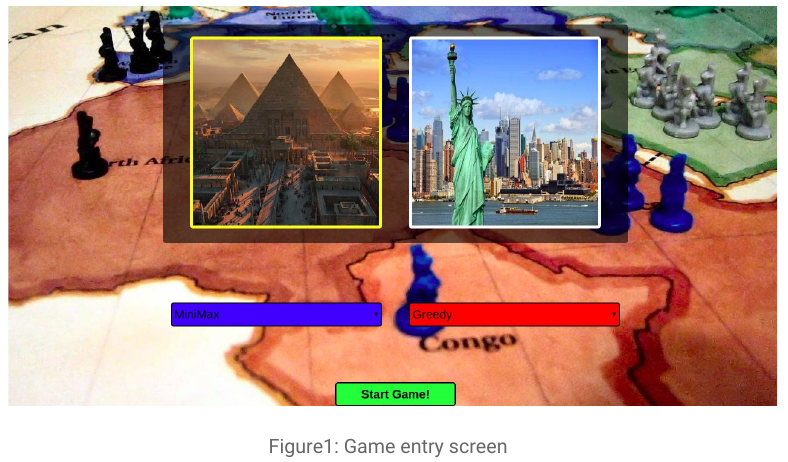
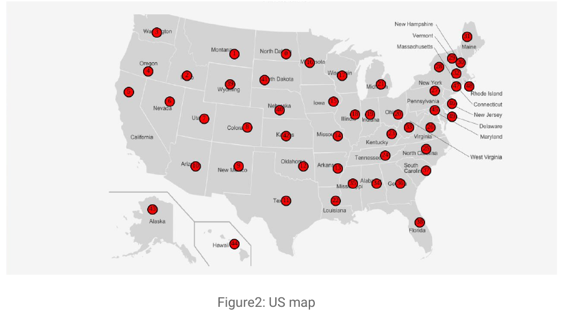
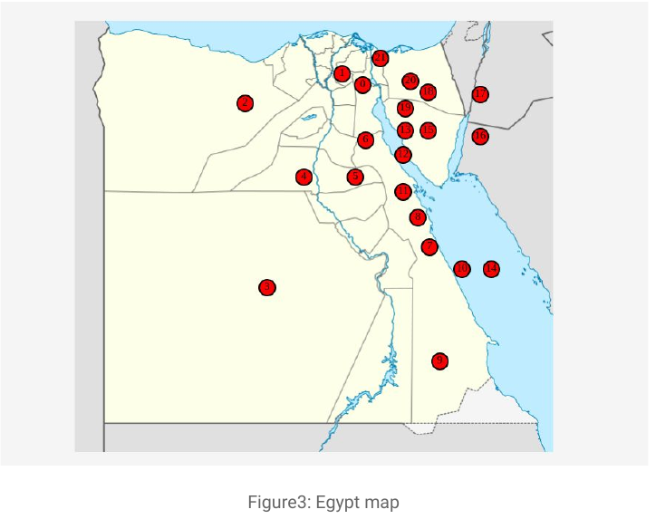

<h1 align='center'>RISKY</h1>

 

## About RISK Game
Risk is a popular complex board game, produced by **Hasbro**, and involves both luck and
**strategy** skills. In Risk, the **objective** is to conquer the world by attacking to acquire
territory and defending your own territory from your opponents. Players are eliminated
when they lose all of their troops on the game board. Players must be skilled in troop
deployment and must be aware of the underlying probabilities present in the game. Risk
is a turn-based game and is best if played with two to six players.
You can read more about RISK game and the full version of rules defined in [1].

## Our Version of the Game
An abstract and simple version of the Risk game board map will not be the whole world
but Egypt or United States. The players of the game will be a mix o f Non AI agents and
AI agents.

At the start each player has 20 armies to be placed over the available territories in the
board. Each turn consists of two parts: placing armies and attacking. At the beginning
of the turn, count the total number of territories the player own and divide by three.
This is the number of additional armies the player will receive for territory (ignoring
fractions). If the number of territories divided by three is less than three, the player
receives three armies instead.

After placing the armies the player may declare attacks. Attack could be done on
territories adjacent to the territories the player own, where the attacking territory
contains two or more armies. The player may attack with any number of armies except
for one, which must remain to defend the territory.

Developed that version of the Risk game with two modes: simulation mode
and playing mode. In the simulation mode, the user will choose any two agents from
the defined agents except for the human agent, to play against each other. In the
playing mode, the human agent will choose only one agent to play against it.

## Agents we built
### AI Agents 
- A **greedy** agent, that picks the move with best immediate heuristic value. It is an informed search agent that uses the heuristic function “h(n)” to estimate how close a state is to goal.

- An agent using **A Star search**, with the same heuristic. It is an informed search agents that combines the heuristic function “h(n)” and goal from root function “g(n)” to estimate how close a state is to goal through the value of ​“f(n)”
where f(n) = h(n) + g(n).

- An agent using **real-time A Star search.** It is an informed search agent that act mainly as A* but reduce the execution time of A*. RTA* calculate f(n) for each node it examines but the difference between it and A* that g(n) is the cost from the current state to the node "n".

- An agent using **Minimax search with alpha-beta pruning**. The Minimax is a kind of Backtracking algorithm that is used in decision making and game theory to find the optimal move for a player, assuming that your opponent also plays
optimally. Alpha-Beta pruning is not actually a new algorithm, rather an optimization
technique for minimax algorithm. It reduces the computation time by a huge factor. This
allows us to search much faster and even go into deeper levels in the game tree. It cuts
off branches in the game tree which need not be searched because there already exists
a better move available.

### Non-AI Agents
- A **human** agent.
- A **completely passive** agent, that places all of its bonus armies to the territory with the fewest armies, and doesn’t make any attacks.
- An **aggressive** agent, that always places all its bonus armies on the territory with
the most armies, and greedily attempts to attack territories with most armies that
he can attack.
- A **nearly pacifist** agent, that places its armies like the completely passive agent,
then conquers only one territory with fewest armies (if it can).

## GUI of Game

For the GUI of our game, we decided to take a **web based approach**, implementing a
classic backend server with a simple frontend to work on.

Our first approach was to use **HTTP Requests & Responses** between backend and
frontend with a templating engine working to render frontend side. The problem with
this approach is that it isn’t perfect for interactive games, where responses and
requests occur in non-deterministic times.

A second approach is **WebSocket**, which is a new communication protocol
introduced with HTML5. Unlike HTTP connections, a WebSocket connection is a
permanent, bi-directional communication channel between a client and the server,
where either one can initiate an exchange.
Once established, the connection remains available until one of the parties
disconnects from it. WebSocket connections are useful for games or web sites that
need to display live information with very low latency.
Another merit of using WebSockets, is that it is integrated and working with Flask
app server through flask-SocketIO.
**Flask** is a micro web framework written in Python, used to build simple and easy yet
powerful web apps that take less than 20 lines of code for a server to be up and
running.

Now we recommend you take a look at the references below for more exploration and maybe try building it yourself using them one day. :closed_book: :green_book:

## Team Acknolwedgments

- [@oswidan97](https://github.com/oswidan97)
- [@MostafaYousry](https://github.com/MostafaYousry)
- [@ramikhafagi96](https://github.com/ramikhafagi96)

## References

1. *[The Strategy of RISK, by Garrett Robinson](http://web.mit.edu/sp.268/www/risk.pdf)*

2. *[Easy WebSockets with Flask and Gevent, by Miguel Grinberg in 2014](https://blog.miguelgrinberg.com/post/easy-websockets-with-flask-and-gevent)*

3. *[Flask Socket-IO Library Documentation](https://flask-socketio.readthedocs.io/en/latest/)*

4. *[Creating an AI for Risk board game, on January 7, 2018, by Martin Sonesson](https://martinsonesson.wordpress.com/2018/01/07/creating-an-ai-for-risk-board-game/)*

5. *[Hahn, Franz. "Evaluating Heuristics in the Game Risk: An Artificial Intelligence Perspective." PhD diss., B. Sc. Thesis, Maastricht Univ., Netherlands, 2010.](https://project.dke.maastrichtuniversity.nl/games/files/bsc/Hahn_Bsc-paper.pdf)*

6. *[Korf, Richard E. "Real-time heuristic search." Artificial intelligence 42, no. 2-3 (1990): 189-211.](https://www.sciencedirect.com/science/article/abs/pii/0004370290900544)*

---

<h3 align='center'>Made with :heart:</h3>
